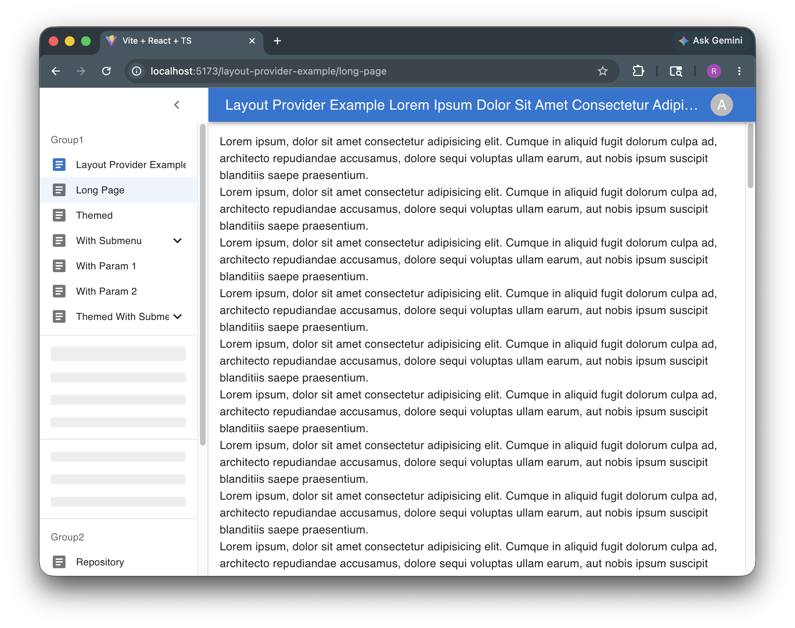

# mui-admin-layout

> **Note**: This documentation was generated with the assistance of AI. While we strive for accuracy, please verify any code examples or implementation details in your specific use case.

A Material-UI based admin layout component library for React applications. 




## Installation

This package is published to AWS CodeArtifact. Make sure your npm config already maps the `@cwncollab-org` scope to the `cwncollab` CodeArtifact repository before installing.

```bash
npm install @cwncollab-org/mui-admin-layout
# or
yarn add @cwncollab-org/mui-admin-layout
# or
pnpm add @cwncollab-org/mui-admin-layout
```

## Publish

This package is published manually to AWS CodeArtifact.

1. Configure AWS CLI v2 locally with credentials that can publish to CodeArtifact.
2. Use Node 20 or 22 LTS when validating or publishing the package.
3. Bump the version in `package.json`.
4. Validate the package contents:

```bash
npm run build
npm pack --dry-run
```

5. Publish the package:

```bash
npm run publish:aws
```

If you use a non-default AWS CLI profile:

```bash
AWS_PROFILE=cwncollab-publish npm run publish:aws
```

On Windows PowerShell:

```powershell
$env:AWS_PROFILE = "cwncollab-publish"
npm run publish:aws
```

Pass extra publish flags after `--` if needed:

```bash
npm run publish:aws -- --tag beta
```

Default non-secret publish settings:

- `AWS_REGION=ap-southeast-1`
- `CODEARTIFACT_DOMAIN=cwncollab`
- `CODEARTIFACT_DOMAIN_OWNER=619005574504`
- `CODEARTIFACT_REPOSITORY=cwncollab`
- `DEFAULT_NPM_REGISTRY=https://registry.npmjs.org/`
- `CODEARTIFACT_REGISTRY=https://cwncollab-619005574504.d.codeartifact.ap-southeast-1.amazonaws.com/npm/cwncollab/`

Notes:

- `scripts/publish-codeartifact.cjs` is the single cross-platform wrapper around AWS CLI and npm.
- The script runs `aws codeartifact login`, resets the user-level npm registry back to `npmjs`, and then publishes explicitly to CodeArtifact.
- `package.json` keeps `publishConfig.registry` pointed at CodeArtifact as a safety net for direct `npm publish` usage.
- Keep AWS credentials in local AWS CLI config or an `AWS_PROFILE`; do not commit tokens or `.npmrc` credentials.
- The publish identity needs `codeartifact:GetAuthorizationToken`, `sts:GetServiceBearerToken`, and `codeartifact:PublishPackageVersion`. Add `codeartifact:ReadFromRepository` too if you also want `npm ping` or installs through the same identity.

## Usage

Here's a basic example of how to use the AdminLayout component:

```tsx
import { AdminLayout, AdminLayoutProvider } from '@cwncollab-org/mui-admin-layout'
import { MenuItem, ThemeProvider, createTheme, Avatar, CssBaseline } from '@mui/material'
import { Form, Person } from '@mui/icons-material'
import { Outlet } from '@tanstack/react-router'
import { useAppBarStateValue } from '@cwncollab-org/mui-admin-layout'

// Create a theme instance
const theme = createTheme({
  // You can customize your theme here
})

// Define your navigation list
export const navList = {
  items: [
    {
      icon: <Form />,
      label: 'Dashboard',
      path: '/dashboard',
    },
    {
      icon: <Form />,
      label: 'Users',
      path: '/users',
    },
  ],
}

function App() {
  return (
    <ThemeProvider theme={theme}>
      <CssBaseline />
      <AdminLayoutProvider mobileMaxWidth={600}>
        <MainLayout />
      </AdminLayoutProvider>
    </ThemeProvider>
  )
}

// Create a separate layout component to control menu open state
function MainLayout() {
  const { setValue: setMenuOpen } = useAppBarStateValue('menuOpen')

  return (
    <AdminLayout
      title="My Admin App"
      navList={navList}
      avatar={
        <Avatar sx={{ width: 32, height: 32 }}>
          <Person />
        </Avatar>
      }
      menuItems={[
        [
          <MenuItem 
            dense 
            key="account" 
            onClick={() => setMenuOpen(false)}
          >
            Account
          </MenuItem>,
          <MenuItem 
            dense 
            key="logout" 
            onClick={() => setMenuOpen(false)}
          >
            Logout
          </MenuItem>,
        ],
      ]}
    >
      {/* Your page content goes here */}
      <Outlet />
    </AdminLayout>
  )
}


```

### Using Layout State

You can control the layout state using the provided hooks:

```tsx
import { useAppBarStateValue, useLayoutStateValue } from '@cwncollab-org/mui-admin-layout'
import { Box, FormControlLabel, Stack, Switch } from '@mui/material'

function LayoutControls() {
  const { value: menuOpen, setValue: setMenuOpen } = useAppBarStateValue('menuOpen')
  const { value: sidebarOpen, setValue: setSidebarOpen } = useLayoutStateValue('sidebarOpen')

  return (
    <Box sx={{ p: 3 }}>
      <Stack>
        <FormControlLabel
          control={
            <Switch
              checked={menuOpen}
              onChange={() => setMenuOpen(!menuOpen)}
            />
          }
          label="Menu Open"
        />
        <FormControlLabel
          control={
            <Switch
              checked={sidebarOpen}
              onChange={() => setSidebarOpen(!sidebarOpen)}
            />
          }
          label="Sidebar Open"
        />
      </Stack>
    </Box>
  )
}
```

## For AI Agents

> See also: [`AGENTS.md`](AGENTS.md) for a standalone version of this section.

This section gives an AI coding agent the minimum facts needed to integrate this library into a consumer project — either via the published npm package (Option A) or by copying the source files directly (Option B).

### Project facts

- Package: `@cwncollab-org/mui-admin-layout`, version `1.2.0`.
- Module format: ESM only (`"type": "module"`). Entry: `./dist/index.js`. Types: `./dist/index.d.ts`.
- License: MIT.
- Peer dependencies (exact versions expected in the host app):
  - `react@19.2.5`
  - `react-dom@19.2.5`
  - `@mui/material@9.0.0`
  - `@emotion/react@11.14.0`
  - `@emotion/styled@11.14.0`
  - `@tanstack/react-router@1.168.23`
- Public API (re-exported from `src/lib/index.ts`):
  - Components: `AdminLayout`, `AdminLayoutProvider`, `AppBar`, `NotFoundPage`
  - Hooks: `useAppBarStateValue`, `useIsMobile`, `useLayoutState`, `useLayoutStateValue`
  - Utilities: `isPlaceholderNavList`
  - Types: `NavItem`, `NavList`, `PlaceholderNavList`
- Required provider wrapping order: `ThemeProvider` → `CssBaseline` → `AdminLayoutProvider` → `AdminLayout`.
- Routing assumption: the host app uses TanStack Router. `AdminLayout` renders its children inside the layout shell; pages are typically rendered via `<Outlet />`.

### Option A — Install via npm (recommended)

Prerequisite: the host project's `.npmrc` must map the `@cwncollab-org` scope to the CodeArtifact registry (see the [Installation](#installation) section above for the registry URL).

```bash
# Install the library
npm install @cwncollab-org/mui-admin-layout

# Install peer dependencies (skip any the host already has at matching versions)
npm install react@19.2.5 react-dom@19.2.5 \
  @mui/material@9.0.0 @emotion/react@11.14.0 @emotion/styled@11.14.0 \
  @tanstack/react-router@1.168.23
```

Then follow the [Usage](#usage) example above. Imports use the bare specifier:

```ts
import { AdminLayout, AdminLayoutProvider } from '@cwncollab-org/mui-admin-layout'
```

### Option B — Vendor the source (no npm access)

Use this when the consumer project cannot reach AWS CodeArtifact (no AWS credentials, air-gapped environment, etc.).

1. Plain-copy the entire `src/lib/` directory from this repository into the consumer project, e.g. to `<consumer>/src/mui-admin-layout/`. The tree to copy:

   ```
   src/lib/
     AdminLayout.tsx
     AdminLayoutProvider.tsx
     index.ts
     hooks/
     layout/
     pages/
     provider/
   ```

2. Install the same peer dependencies listed in [Project facts](#project-facts) into the consumer project.

3. Replace any import of the package specifier with a relative path to the vendored folder:

   ```ts
   // Before (Option A)
   import { AdminLayout } from '@cwncollab-org/mui-admin-layout'

   // After (Option B)
   import { AdminLayout } from './mui-admin-layout'
   ```

4. Notes:
   - The vendored files are `.tsx` ESM sources — no build step is required. Any TS-aware bundler (Vite, Next.js, etc.) will transpile them.
   - Preserve the MIT `LICENSE` notice when redistributing the copied code.
   - Keep the folder structure intact; internal imports within `src/lib/` are relative.

### Common pitfalls

- Calling `useAppBarStateValue` / `useLayoutStateValue` / `useLayoutState` outside an `AdminLayoutProvider` subtree throws at runtime.
- Omitting `<CssBaseline />` causes incorrect spacing and scrolling behavior.
- Mismatched peer-dep major versions (especially MUI v9, React 19, TanStack Router) will cause type errors and/or runtime failures.
- Hooks used outside the `AdminLayout` tree will not see the expected layout context.

## License

MIT
